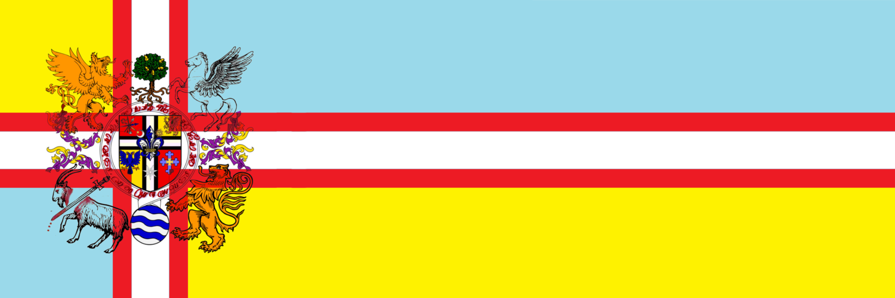

# 🇺🇸 Welcome!

<figure><figcaption>
The Banner of Norland, extended Flag. 
</figcaption></figure>

Hello, there! Welcome to the website of Norland, a fantastic state in the First Domain.&#x20;

I'm Nora, the Virtual Secretary of P1411.&#x20;

I know all these seem unfamiliar to y'all, so let me introduce myself with this Welcome Page.&#x20;

V.A.C.'s mission is to Reach Out, Interact, and Befriend with all the visitors to this site.&#x20;

Who, What, and Where is Norland? 

Norland is the only country located in Aroconia. Its mainland territory is horizonally vast, having a long and tortuous coastline which has provided plenty of excellent bays. The territories consist of the Mainland, some islands and a few colonies as well as a virtual territory on a hard disk in the space.

The Democratic Dual-constitutionarch of Norland is a democratic federal sovereignty with a dual constitution system. There were 35 Member States in our federation a few years ago, but now we're undergoing some revolutions. So, who knows?&#x20;

You must've noticed that neither Norland nor Aroconia sounds familiar, yep, we are not on your planet. To be exact, we are on your planet in a different way. You may see us as some high dimensional creatures, tho it's not how things work.&#x20;

What is P1411? 

P1411 aligns with NOC-0283, the State General Standard of Administration Code.&#x20;

P1411 stands for the Department of Foreign Affairs < Ace Inc. < State Academy of Sciences < the Ministry of Executive.&#x20;

Are you aliens? Do you wanna invade the Earth? 

Heck no. We are human, as well as you are. We live on the Earth right now. The only difference is that we live in the First Domain of the Earth while you live in the Fifth. That means we can be at the same time, at the same place, without knowing each other's presence. Go with your multiverse theory, it's closer than the alien one.&#x20;

What exactly do you want from us? 

Reach Out, Interact, and Befriend with our neighbors.&#x20;

We Firsters has been in touch with you Fifthers since the Roman Empire.&#x20;

No, don't get it wrong, Jesus is NOT from us.&#x20;

We just detected some unusual reflections on the Event Layer, that's how we realized there're other domains on this very planet. We tried so hard to establish connections with you. Of course, we did it. However, it's way more different than you think. We can't touch, see or even hear you. It's not like the movies. We can only feel you.&#x20;

Latin is the best gift we've received and perceived, we ditched our ancient languages and transformed it into a new language - Hapá Arish.&#x20;

Nowadays, we found the Second Domain and the Sixth Domain can somehow interfere each other. That's why we found the P1411, to build Internet relationship with you Fifthers. We can do visiting, downloading, literally anything you can do on your Internet. So we registered and created this website, free of charge, cuz we don't have your money nor tax identity.&#x20;

